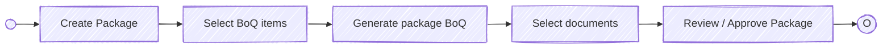
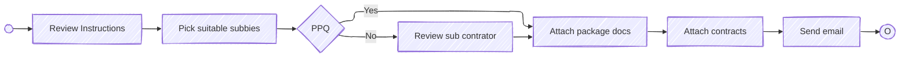

# BuildFlow Construction management

## Tender Management

## Sub Contractor Packaging
### Sub contractor pre qualification
Assumption: Contractor prequalification (PQQ) - We will build this into contractor onboarding and will have a review step included in the flow to check the contractor pre-qualification is still good.

### Sub Package Creation

### Sub-contractor invitation to tender

