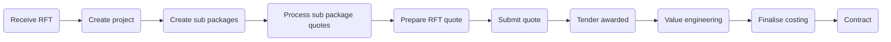
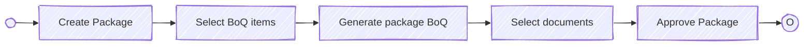
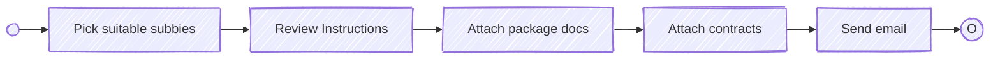

# BuildFlow Construction management

## Tender Management

```mermaid
flowchart LR
    A(Receive RFT)
    B(Create project)
    C(Create sub packages)
    D(Process sub package quotes)
    E(Prepare RFT quote)
    F(Submit quote)
    G(Tender awarded)
    H(Value engineering)
    I(Finalise costing)
    J(Contract)

    A --> B
    B --> C
    C --> D
    D --> E
    E --> F
    F --> G
    G --> H
    H --> I
    I --> J
```

## Sub Contractor Packaging

```mermaid
---
config:
  layout: elk
  look: handDrawn
---
flowchart LR
  A((    )) --> B[Create Package]
  B --> C[Select BoQ items]
  C --> D[Generate package BoQ]
  D --> E[Select documents]
  E --> F[Approve Package]
  F --> G((O))
```
## Sub Contractor Packaging

```mermaid
---
config:
  layout: elk
  look: handDrawn
---
flowchart LR
  A((    )) --> B[Pick suitable subbies]
  B --> C[Review Instructions]
  C --> D[Attach package docs]
  D --> E[Attach contracts]
  E --> F[Send email]
  F -->G((O))
```
