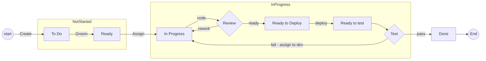

## Task status in dev cycle

```mermaid
flowchart LR
    A((start)) --> |Create| B[To Do]
    subgraph NotStarted
    B -->|Groom| C[Ready]
    end
    C -->|Assign| D[In Progress]
    subgraph InProgress
    D -->|code| E{Review}
    E -->|rework| D
    E -->|ready| F[Ready to Deploy]
    F -->|deploy| G[Ready to test] 
    G --> H{Test}
    end
    H -->|pass| I[Done]
    H -->|fail - assign to dev| D
    I --> J((End))
```
