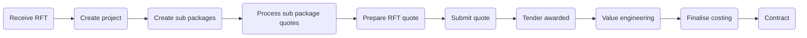

## Tender Management

```mermaid
flowchart LR
    A(Receive RFT)
    B(Create project)
    C(Create sub packages)
    D(Process sub package quotes)
    E(Prepare RFT quote)
    F(Submit quote)
    G(Tender awarded)
    H(Value engineering)
    I(Finalise costing)
    J(Contract)

    A --> B
    B --> C
    C --> D
    D --> E
    E --> F
    F --> G
    G --> H
    H --> I
    I --> J
```
